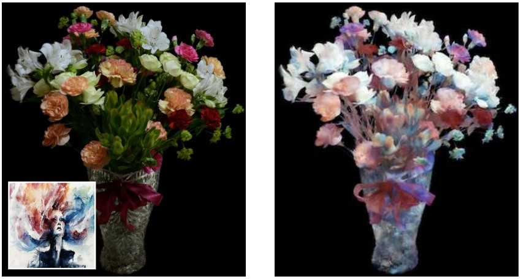

# FastSplatStyler
Official Implementation of "Optimization-Free Style Transfer of 3D Gaussian Splats"

[arXiv Paper](https://arxiv.org/abs/2508.05813)

## Example Outputs

Example Outputs can be visualized at the following links.

**Coming soon**

Example inputs and outputs can be downloaded [here](https://drive.google.com/drive/folders/10YmtcCOKGosXfPEi84ho1AfYRYioYo12?usp=drive_link)

## Demo

**Coming soon**

## Install

This work relies heavily on the [Pytorch](https://pytorch.org/) and [Pytorch Geometric](https://www.pyg.org/) libraries.

This code was tested with Python 3.12, Pytorch 2.9.1 (CUDA Toolkit 12.8), and Pytorch Geometric 2.8 on Windows.

This repository relies on a graph networks library that was presented in a [previous work](https://github.com/davidmhart/interpolated-selectionconv/tree/main). The library can be downloaded, with included model weights, at this [google drive link](https://drive.google.com/drive/folders/10YmtcCOKGosXfPEi84ho1AfYRYioYo12?usp=drive_link). Place the "graph_networks" folder in the main directory.

To stylize a splat, run `python styletransfer_splat.py filename.splat`

Supports `.splat` and `.ply` files.
